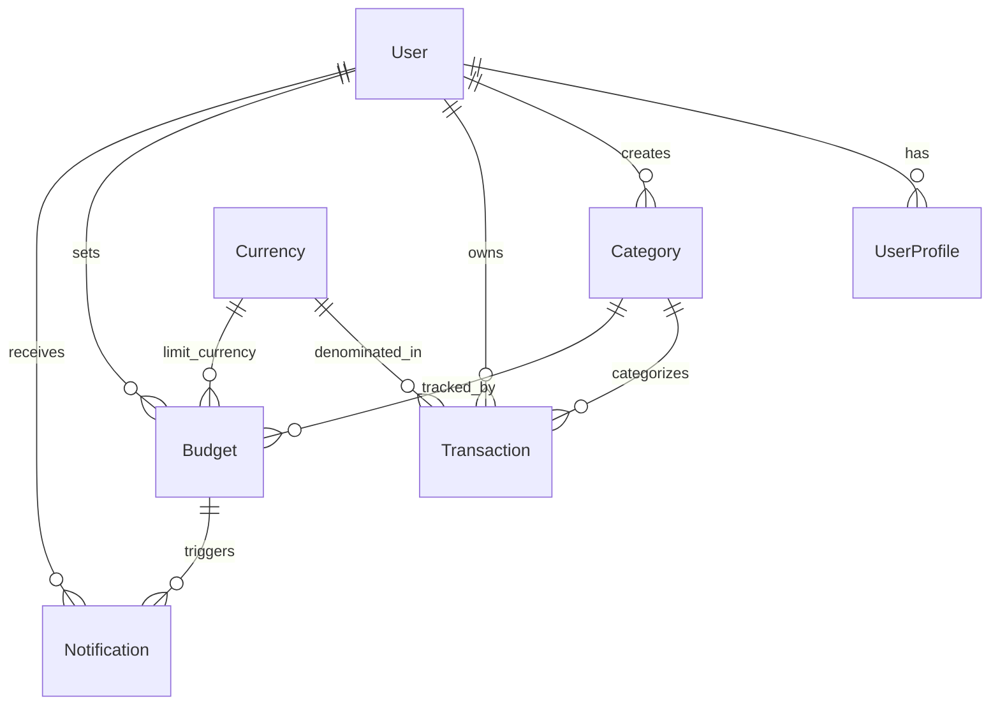
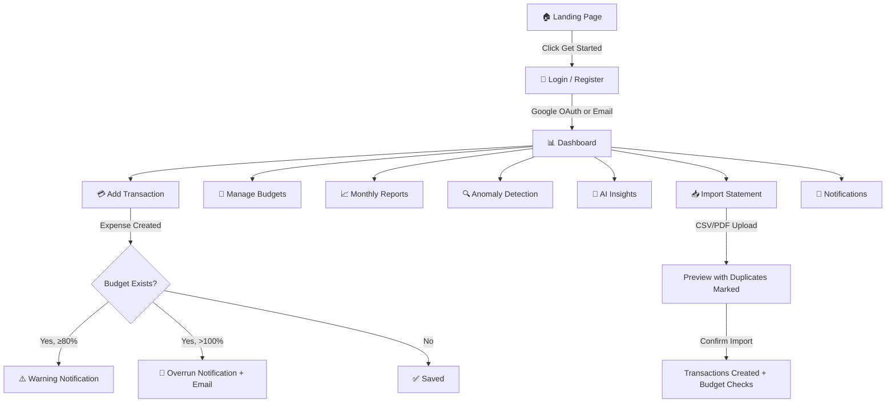
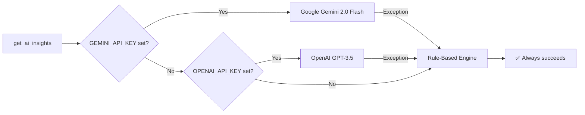
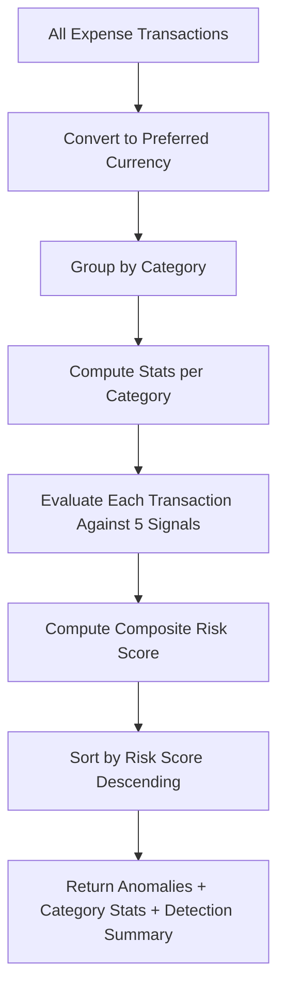
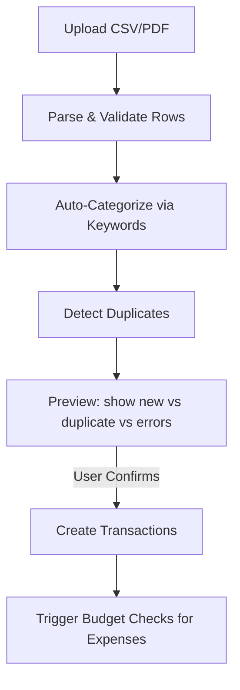

# 💰 Personal Finance Tracker

A **production-grade, AI-assisted** personal finance tracking application built with Django , **PostgreSQL**, and **Google Gemini** / **OpenAI**.

The system prioritizes **clarity**, **explainability**, **robustness**, and **graceful failure handling** — no opaque automation, no brittle single-points-of-failure.

> **Live Demo:** [Deployed on Render](https://finance-tracker-nd53.onrender.com/)

---

## 📑 Table of Contents

1. [Project Overview](#-project-overview)
2. [Key Features](#-key-features)
3. [Architecture & Project Structure](#-architecture--project-structure)
4. [Data Models & Schema](#-data-models--schema)
5. [Application Flow](#-application-flow)
6. [AI Insights Engine](#-ai-insights-engine)
7. [Multi-Signal Anomaly Detection](#-multi-signal-anomaly-detection)
8. [Notification System](#-notification-system)
9. [Multi-Currency Engine](#-multi-currency-engine)
10. [Bank Statement Import](#-bank-statement-import)
11. [Authentication & Security](#-authentication--security)
12. [Failure Handling Philosophy](#-failure-handling-philosophy)
13. [Tech Stack](#-tech-stack)
14. [Setup & Installation](#-setup--installation)
15. [Environment Variables](#-environment-variables)
16. [Testing](#-testing)
17. [Deployment (Render)](#-deployment-render)
18. [Docker Support](#-docker-support)
19. [Screenshots](#-screenshots)
20. [Demo Credentials](#-demo-credentials)

---

## 🎯 Project Overview

### Problem Statement

Managing personal finances becomes difficult as data grows over time. Common approaches — spreadsheets or standard banking apps — require significant manual effort or provide limited insight into spending behavior. While these tools record transactions reliably, they fail to **explain patterns**, **detect risks**, or recommend **actionable next steps**.

### What This App Solves

| Capability | How It Helps |
|---|---|
| **Structured Data Entry** | Validated transactions with category enforcement and receipt uploads |
| **Clear Reporting** | Monthly reports, category breakdowns, and trend charts with real numbers |
| **AI-Driven Insights** | Personalized advice from Gemini/OpenAI with a deterministic fallback |
| **Risk Detection** | Multi-signal anomaly scoring (0–100) that explains *why* something is flagged |
| **Budget Guardrails** | Real-time tracking with 80% warnings and overrun alerts |
| **Multi-Currency** | Record transactions in any currency; analytics normalized via USD |
| **Notifications** | In-app alerts + email via Resend for budget breaches |

### Target Audience

- Individuals and families seeking better visibility into spending
- Users who prefer **transparency** over black-box automation
- Reviewers and engineers evaluating production-ready Django systems

### Production Readiness

This is **not** a demo project. It is built for real usage:

- Multi-user support with **strict data isolation** (every query is user-scoped)
- PostgreSQL as the primary database
- Environment-based configuration (12-factor aligned)
- External services abstracted behind interfaces with graceful fallbacks
- **60+ automated tests** across all three apps

---

## ✨ Key Features

### 1. Transaction Tracking & Categorization

- Full CRUD for transactions with form validation
- User-defined categories (Income / Expense / Investment)
- Type is **auto-set from category** (denormalized for query performance, single source of truth)
- Negative amounts allowed **only** for expense refunds
- Decimal precision enforced via `ROUND_HALF_UP` quantization
- Receipt upload support (images/PDFs stored in `receipts/%Y/%m/`)
- `on_delete=PROTECT` prevents deleting categories with linked transactions

### 2. Multi-Currency Support

- Each transaction records its currency
- 7 pre-seeded currencies: USD, EUR, GBP, INR, JPY, AUD, CAD
- All analytics normalize through **USD as intermediary**: `source → USD → target`
- User's preferred display currency is configurable per profile
- Currency context is preserved for display; amounts normalized internally for analytics

### 3. Budget Monitoring

- Monthly budgets per expense category
- Month auto-normalized to the 1st (e.g., Feb 15 → Feb 1)
- `spent` property computes real-time from transactions (normalized to budget currency)
- `percentage_used`, `is_overrun` — computed properties, not stale snapshots
- **80% warning** threshold triggers `BUDGET_WARNING` notification
- **Overrun** triggers `BUDGET_OVERRUN` notification
- Escalation logic: a warning can escalate to overrun without duplicating
- Budget-to-user ownership validation prevents cross-user abuse

### 4. Reports & Analytics

Interactive dashboards provide insight into:

- **Stat cards**: total income, expense, investment, net savings (current month)
- **Category-wise spending**: doughnut chart via Chart.js
- **Monthly trends**: 6-month income vs. expense line chart
- **Budget health**: color-coded progress bars with warning/overrun indicators
- **Monthly reports**: selectable year/month with pie charts for income and expense breakdowns
- **Recent transactions**: last 5, with amount in user's preferred currency

### 5. AI-Powered Financial Insights

Personalized insights generated from transaction history, budget usage, and spending patterns.

- Insights are **advisory only** — they never modify user data
- Three-tier provider strategy with deterministic fallback (see [AI Insights Engine](#-ai-insights-engine))
- The UI clearly displays which provider was used (Gemini / OpenAI / Rule-Based)

### 6. Multi-Signal Anomaly & Fraud Detection

Each expense transaction is evaluated against **five independent detection signals** and assigned a composite risk score (0–100), enabling ranked and explainable detection (see [Anomaly Detection](#-multi-signal-anomaly-detection)).

### 7. Bank Statement Import

Upload CSV or PDF bank statements with:
- Auto-categorization via keyword matching
- Duplicate detection (same date + amount + description)
- Dry-run preview before committing
- Sample CSV download for format reference

### 8. In-App & Email Notifications

- Budget warnings (80%+) and overrun alerts
- In-app notification center with mark-as-read and clear-all
- Email alerts via **Resend SDK** for critical events
- Notification badge in the nav bar (via context processor)

### 9. Google OAuth Authentication

- One-click Google Sign-In on both login and registration pages
- Powered by `django-allauth` with automatic `SocialApp` provisioning
- Graceful handling: if OAuth credentials are not configured, the Google button simply doesn't appear

---

## 🏗 Architecture & Project Structure

### Design Principles

| Principle | Implementation |
|---|---|
| **Thin Views** | Views handle HTTP only; all business logic lives in `services.py` |
| **Service Layer** | `finance/services.py` — all CRUD + budget-check side-effects |
| **Selector Layer** | `reports/selectors.py` — all aggregation queries isolated from views |
| **External Abstraction** | AI providers, email, and OAuth are abstracted behind interfaces |
| **Strict User Scoping** | Every queryset is filtered by `user=request.user` |
| **Validation at Model Level** | `full_clean()` called in `save()` — invalid data can never persist |

### Project Structure

```
FJ-BE-R2-Satyam-Keshari-IIIT-Pune/
│
├── core/                        # Authentication & User Profiles
│   ├── models.py                # UserProfile (auto-created via post_save signal)
│   ├── views.py                 # register, login, logout, profile views  
│   ├── forms.py                 # UserRegistrationForm, ProfileUpdateForm
│   ├── management/commands/
│   │   └── configure_site.py    # Sets Django Site domain + Google SocialApp
│   └── tests.py                 # 12 auth & profile tests
│
├── finance/                     # Core Financial Logic
│   ├── models.py                # Currency, Category, Transaction, Budget, Notification
│   ├── services.py              # Business logic: CRUD + budget overrun checks + email
│   ├── views.py                 # Transaction, Category, Budget, Notification, Import views
│   ├── forms.py                 # TransactionForm, BudgetForm, CategoryForm
│   ├── import_service.py        # CSV/PDF bank statement parser + importer
│   ├── import_forms.py          # StatementUploadForm
│   ├── currency_utils.py        # Multi-currency conversion (USD intermediary)
│   ├── context_processors.py    # Injects unread notification count into all templates
│   ├── management/commands/
│   │   └── seed_currencies.py   # Seeds 7 currencies with exchange rates
│   └── tests.py                 # 50+ model, service, view, import tests
│
├── reports/                     # Analytics, AI & Anomaly Detection
│   ├── selectors.py             # Dashboard summary, monthly report, trends, insights
│   ├── ai_insights.py           # LLM-powered insights (Gemini → OpenAI → Rule-based)
│   ├── anomaly.py               # Multi-signal anomaly detection engine
│   ├── views.py                 # Dashboard, monthly report, anomaly, AI insights views
│   └── tests.py                 # Selector, anomaly, AI, view tests
│
├── templates/
│   ├── base.html                # Shared layout (nav, messages, footer)
│   ├── home.html                # Landing page (standalone, animated)
│   ├── includes/
│   │   └── nav_notifications.html
│   ├── core/
│   │   ├── login.html           # Login + Google OAuth
│   │   ├── register.html        # Registration + Google OAuth
│   │   └── profile.html
│   ├── finance/
│   │   ├── transaction_*.html   # List, create, edit, detail, delete
│   │   ├── budget_*.html        # List, create, edit, delete
│   │   ├── category_*.html      # List, create, delete
│   │   ├── notification_list.html
│   │   └── import_statement.html
│   └── reports/
│       ├── dashboard.html       # Stat cards + Chart.js charts
│       ├── monthly_report.html  # Year/month selector + pie charts
│       ├── anomaly.html         # Risk-scored anomaly table
│       └── ai_insights.html     # LLM insights cards
│
├── finance_tracker/             # Django Project Config
│   ├── settings.py              # All settings, allauth config, LLM keys
│   └── urls.py                  # Root URL routing
│
├── manage.py
├── requirements.txt
├── build.sh                     # Render build script
├── render.yaml                  # Render blueprint
├── Dockerfile                   # Production container
├── docker-compose.yml           # Local dev with PostgreSQL
└── docker-entrypoint.sh         # Container entrypoint
```

### Request Flow (Sequence)

```
Browser → URL Router → View (thin) → Service Layer → Model (with validation)
                                   ↘ Selector Layer → Aggregated Data → Template
                                   ↘ AI/Anomaly Engine → Insights/Scores → Template
```

---

## 🗄 Data Models & Schema

### Entity Relationship



### Model Details

| Model | Key Fields | Validation Rules |
|---|---|---|
| **Currency** | `code` (ISO 4217), `symbol`, `exchange_rate_to_usd` | Unique code, active flag |
| **Category** | `user`, `name`, `type` (INCOME/EXPENSE/INVESTMENT) | Unique per (user, name, type); blank name rejected |
| **Transaction** | `user`, `category`, `amount`, `currency`, `date`, `receipt` | `type` auto-set from category; zero rejected; negative only for EXPENSE refunds; cross-user category blocked; decimal quantized |
| **Budget** | `user`, `category`, `limit_amount`, `month`, `currency` | Expense categories only; positive limit; month normalized to 1st; unique per (user, category, month) |
| **Notification** | `user`, `budget`, `message`, `notification_type`, `is_read` | Types: `BUDGET_WARNING` (80%+), `BUDGET_OVERRUN` |
| **UserProfile** | `user` (OneToOne), `preferred_currency` | Auto-created via `post_save` signal on User |

### Key Design Decisions

1. **`Transaction.type` is denormalized** from `Category.type` — set automatically in `save()` and `clean()`, never user-editable. This avoids a JOIN on every aggregation query while the model-level enforcement guarantees consistency.

2. **`on_delete=PROTECT`** on `Transaction.category` and `Transaction.currency` — prevents accidental data loss by blocking deletion of in-use categories/currencies.

3. **`Budget.spent` is a computed property**, not a cached column — it queries live transaction data, so budget status is always real-time and never stale.

4. **Database indexes** on `(user, date)`, `(user, category)`, `(user, type)` for efficient filtered queries.

---

## 🔁 Application Flow

### User Journey



### Service Layer Flow (Transaction Create)

```python
# views.py → services.py → model
def create_transaction(user, cleaned_data):
    transaction = Transaction(user=user, **cleaned_data)
    transaction.save()        # → full_clean() validates + auto-sets type
    if transaction.type == 'EXPENSE':
        _check_budget_overrun(user, transaction)  # → notifications + email
    return transaction
```

### Budget Overrun Check Logic

```python
def _check_budget_overrun(user, transaction):
    for budget in matching_budgets:
        if budget.is_overrun:
            create_notification(type='BUDGET_OVERRUN')
            send_email_via_resend()  # fails silently if no API key
        elif budget.percentage_used >= 80:
            create_notification(type='BUDGET_WARNING')
```

**De-duplication**: If a notification of the same type already exists for the same budget, the message is updated in-place rather than creating a duplicate. A WARNING can escalate to OVERRUN.

---

## 🤖 AI Insights Engine

### Design Philosophy

Financial behavior is contextual and varies between users. Pure rule-based systems tend to overfit, while unconstrained AI can be unreliable. This system uses **AI as a guided reasoning layer**, never as a source of truth.

### Three-Tier Fallback Chain



| Provider | Priority | Cost | When Used |
|---|---|---|---|
| **Google Gemini** | 1st | Free tier | `GEMINI_API_KEY` is set |
| **OpenAI GPT** | 2nd | Paid | Gemini unavailable, `OPENAI_API_KEY` is set |
| **Rule-Based** | 3rd (Final) | Free | Always available, guaranteed insight generation |

### What Data Is Sent to LLMs

Only **summarized, non-sensitive** data:
- Income/expense/investment totals (last 30 days)
- Savings rate percentage
- Top 5 expense categories
- Budget utilization percentages
- No raw transaction IDs, no personal identifiers

### Rule-Based Fallback (Smart Analysis)

When no API keys are configured or all providers fail, the rule-based engine generates **5 types of data-driven insights**:

1. **Savings Rate Analysis** — categorized as Excellent (≥30%), Good (≥15%), Low (<15%), or Negative
2. **Top Spending Category** — concentration warning if >40% of expenses
3. **Budget Health** — overruns, warnings, or all-on-track
4. **Investment Activity** — percentage of income, with nudges if below 15%
5. **Monthly Overview** — summary with exact numbers

Each insight has a `type` field (`positive`, `neutral`, `warning`, `danger`) for color-coded display.

### UI Display

The insights page clearly shows which provider generated the response:
- **"Powered by Google Gemini"** / **"Powered by OpenAI GPT"** / **"Smart Analysis (Rule-Based)"**
- AI output is parsed, validated as JSON, and treated as **read-only guidance**

---

## 🔍 Multi-Signal Anomaly Detection

### Overview

The anomaly detection system uses a **multi-signal composite risk scoring engine** instead of a simple binary flag. Each expense transaction is evaluated against five independent signals.

### Detection Signals

| # | Signal | Weight | What It Detects | Implementation |
|---|---|---|---|---|
| 1 | **Z-Score** | 35 | Statistical outliers (amount > mean + 2σ) | `_zscore_flag()` — returns z-score value |
| 2 | **IQR** | 25 | Robust outliers for skewed data (amount > Q3 + 1.5×IQR) | `_iqr_flag()` — resistant to non-normal distributions |
| 3 | **Round Number** | 15 | Suspiciously round amounts (common fraud pattern) | `_round_number_flag()` — detects exact thousands/500s/100s |
| 4 | **Frequency Spike** | 15 | Unusual daily transaction volume (≥3× average) | `_frequency_spike()` — burst activity detection |
| 5 | **Velocity** | 10 | Same-category clustering (2+ transactions same day) | `_velocity_flag()` — behavioral drift detection |

### Composite Risk Score

```python
def _compute_risk_score(signals):
    score = 0
    weights = {
        'zscore': 35, 'iqr': 25, 'round_number': 15,
        'frequency': 15, 'velocity': 10,
    }
    for signal, weight in weights.items():
        if signals.get(signal):
            score += weight
    return min(score, 100)
```

- Scores range from **0 to 100**
- Transactions are **ranked** rather than binary-classified, improving explainability
- Minimum 3 transactions per category required for statistical analysis

### How Anomalies Are Displayed

- **Color-coded risk badges** (green/yellow/orange/red based on score)
- **Per-signal breakdown** — user sees exactly which signals triggered
- **Sortable anomaly table** — ranked by risk score, with deviation percentages
- **Category statistics** — mean, std deviation, thresholds, and sample sizes
- **Detection summary** — counts per signal type across all categories

### Pipeline



---

## 🔔 Notification System

### In-App Notifications (Primary Channel)

Triggered when:
- Budget crosses **80% warning** threshold → `BUDGET_WARNING`
- Budget is **exceeded** → `BUDGET_OVERRUN`

Features:
- Notification badge in the navigation bar (via `context_processors.py`)
- Mark individual notifications as read
- "Clear All" deletes only read notifications
- De-duplication: same budget+type combination updates the existing notification
- Escalation: WARNING → OVERRUN creates a separate notification

### Email Notifications (Secondary Channel)

Sent via **Resend SDK** for critical events (budget overruns):

```python
resend.Emails.send({
    "from": settings.DEFAULT_FROM_EMAIL,
    "to": [user.email],
    "subject": f'[Finance Tracker] {category} — Budget Overrun',
    "html": f'<p>{message}</p>',
})
```

> **Current limitation:** Using Resend's default sender (`onboarding@resend.dev`), emails can only be sent to the account owner's address. Multi-user email delivery becomes available once a custom domain is verified in Resend.

**Email failures are logged and never affect core functionality.** The application continues working perfectly without Resend.

---

## 💱 Multi-Currency Engine

### Conversion Logic

All conversions use **USD as the intermediary**:

```
Source Amount → × source_rate → USD → ÷ target_rate → Target Amount
```

```python
def convert_amount(amount, from_currency, to_currency):
    if from_currency.pk == to_currency.pk:
        return amount  # No conversion needed
    amount_in_usd = amount * from_currency.exchange_rate_to_usd
    converted = amount_in_usd / to_currency.exchange_rate_to_usd
    return converted.quantize(Decimal('0.01'), rounding=ROUND_HALF_UP)
```

### Pre-Seeded Currencies

| Code | Name | Symbol | Rate to USD |
|---|---|---|---|
| USD | US Dollar | $ | 1.000000 |
| EUR | Euro | € | 1.080000 |
| GBP | British Pound | £ | 1.270000 |
| INR | Indian Rupee | ₹ | 0.012000 |
| JPY | Japanese Yen | ¥ | 0.006700 |
| AUD | Australian Dollar | A$ | 0.650000 |
| CAD | Canadian Dollar | C$ | 0.740000 |

### Fallback & Bootstrap

- If user's preferred currency doesn't exist → **fall back to USD**
- If USD doesn't exist in the database → **auto-create it** (bootstrap scenario)
- This ensures the app never crashes on a fresh database

---

## 📥 Bank Statement Import

### Supported Formats

| Format | Parser | Features |
|---|---|---|
| **CSV** | `parse_csv_statement()` | Flexible column names (`date/description/amount` or `date/description/debit/credit`), multiple date formats |
| **PDF** | `parse_pdf_statement()` | Table extraction via `pdfplumber`, fallback to line-by-line regex parsing |

### Import Pipeline



### Auto-Categorization

Description keywords are matched against a pre-defined mapping:

```python
CATEGORY_KEYWORDS = {
    'EXPENSE': ['grocery', 'restaurant', 'uber', 'rent', 'insurance', ...],
    'INCOME':  ['salary', 'deposit', 'freelance', 'payment received', ...],
    'INVESTMENT': ['investment', 'stock', 'mutual fund', 'crypto', ...],
}
```

If no match is found, an **"Uncategorized" category is auto-created** (per type, per user) — no rows are ever lost.

### Duplicate Detection

Matches on `date + amount + description` (fuzzy). Duplicates are marked in the preview and can be skipped during import.

### Sample CSV Download

A downloadable sample CSV is provided to show the expected format:
```csv
date,description,amount
2026-01-15,Grocery Store,45.99
2026-01-16,Salary Deposit,5000.00
```

---

## 🔐 Authentication & Security

### Authentication Methods

| Method | Implementation |
|---|---|
| **Email/Password** | Django's built-in auth with custom registration form |
| **Google OAuth 2.0** | `django-allauth` with auto-provisioned `SocialApp` |

### Google OAuth Setup

The `configure_site` management command automatically:
1. Sets the Django `Site` domain from `BASE_URL`
2. Creates/updates the Google `SocialApp` with `GOOGLE_CLIENT_ID` and `GOOGLE_CLIENT_SECRET`
3. Links the `SocialApp` to the current `Site`

If OAuth credentials are not set, the Google button **silently disappears** — no error, no crash.

### Security Measures

| Measure | Implementation |
|---|---|
| CSRF protection | Django's built-in middleware |
| Data isolation | Every query filtered by `user=request.user` |
| Cross-user access | Returns HTTP 403 Forbidden |
| Secret management | `python-decouple` reads from `.env`, no secrets in code |
| Production headers | `SECURE_PROXY_SSL_HEADER`, `CSRF_TRUSTED_ORIGINS` configured |
| Static files | Served via WhiteNoise in production |
| `DEBUG=False` | Enforced in production |

---

## 🛡 Failure Handling Philosophy

> **The application never fails hard due to an external dependency.**

| Dependency | What Happens When It's Missing |
|---|---|
| **Gemini API Key** | Falls back to OpenAI, then to rule-based insights |
| **OpenAI API Key** | Falls back to rule-based insights |
| **Resend API Key** | Email notifications skipped; in-app notifications still work |
| **Google OAuth Creds** | Google button hidden; email/password auth still works |
| **Preferred Currency** | Falls back to USD |
| **USD Currency Record** | Auto-created on first access |
| **PDF table extraction** | Falls back to line-by-line regex parsing |
| **Any LLM API call** | Wrapped in `try/except`, falls back to mock insights |
| **Email send failure** | Logged as warning; budget notification still created in-app |
| **Category match (import)** | "Uncategorized" category auto-created |

This design ensures that the app **remains functional and predictable** regardless of which external services are configured.

---

## ⚙️ Tech Stack

### Backend

| Technology | Purpose |
|---|---|
| **Django 5.x** | Web framework |
| **PostgreSQL** | Primary relational database |
| **Django REST Framework** | API foundation |
| **django-allauth 65.x** | Social authentication (Google OAuth) |
| **python-decouple** | Environment variable management |
| **WhiteNoise** | Production static file serving |
| **Gunicorn** | Production WSGI server |

### AI & Machine Learning

| Technology | Purpose |
|---|---|
| **Google Generative AI (Gemini 2.0 Flash)** | Primary LLM for financial insights |
| **OpenAI GPT-3.5** | Secondary LLM fallback |
| **Custom Rule Engine** | Deterministic fallback (always available) |

### Data Processing

| Technology | Purpose |
|---|---|
| **pdfplumber** | PDF bank statement parsing |
| **Python csv** | CSV bank statement parsing |
| **Decimal / ROUND_HALF_UP** | Financial-grade precision throughout |

### Communication

| Technology | Purpose |
|---|---|
| **Resend SDK** | Transactional email delivery |

### Frontend

| Technology | Purpose |
|---|---|
| **Django Templates** | Server-side rendering |
| **Chart.js** | Dashboard charts (doughnut, line) |
| **Google Fonts (Inter)** | Typography |
| **Custom CSS** | Responsive design, animations |

### Infrastructure

| Technology | Purpose |
|---|---|
| **Docker** | Containerized deployment |
| **Render** | Cloud hosting (Web Service + PostgreSQL) |
| **dj-database-url** | Database URL parsing for cloud deployments |

---

## 🚀 Setup & Installation

### Prerequisites

- Python 3.10+
- PostgreSQL 14+
- Git

### Local Development

```bash
# Clone the repository
git clone https://github.com/satyam7535/FJ-BE-R2-Satyam-Keshari-IIIT-Pune.git
cd FJ-BE-R2-Satyam-Keshari-IIIT-Pune

# Create and activate virtual environment
python -m venv venv
source venv/bin/activate        # Linux/macOS
# .\venv\Scripts\activate       # Windows

# Install dependencies
pip install -r requirements.txt

# Configure environment
cp .env.example .env
# Edit .env with your database credentials and API keys

# Run migrations
python manage.py migrate

# Seed currencies (USD, EUR, GBP, INR, JPY, AUD, CAD)
python manage.py seed_currencies

# Configure site domain (needed for OAuth)
python manage.py configure_site

# Create a superuser
python manage.py createsuperuser

# Start the development server
python manage.py runserver
```

Access the app at: `http://127.0.0.1:8000/`

---

## 🔧 Environment Variables

| Variable | Required | Default | Description |
|---|---|---|---|
| `SECRET_KEY` | ✅ | — | Django secret key |
| `DEBUG` | ❌ | `False` | Debug mode (set `True` for local dev) |
| `BASE_URL` | ❌ | `http://127.0.0.1:8000` | Used for Site domain configuration |
| `ALLOWED_HOSTS` | ❌ | `*` | Comma-separated list of allowed hosts |
| `DB_NAME` | ✅ | — | PostgreSQL database name |
| `DB_USER` | ✅ | — | PostgreSQL username |
| `DB_PASSWORD` | ✅ | — | PostgreSQL password |
| `DB_HOST` | ❌ | `localhost` | Database host |
| `DB_PORT` | ❌ | `5432` | Database port |
| `DATABASE_URL` | ❌ | — | Full database URL (overrides DB_* vars on Render) |
| `GEMINI_API_KEY` | ❌ | — | Google Gemini API key (free tier) |
| `OPENAI_API_KEY` | ❌ | — | OpenAI API key (paid) |
| `RESEND_API_KEY` | ❌ | — | Resend email API key |
| `DEFAULT_FROM_EMAIL` | ❌ | `onboarding@resend.dev` | Sender email address |
| `GOOGLE_CLIENT_ID` | ❌ | — | Google OAuth Client ID |
| `GOOGLE_CLIENT_SECRET` | ❌ | — | Google OAuth Client Secret |

> **All optional features degrade gracefully if keys are missing.** The app runs perfectly with just the required variables.

---

## 🧪 Testing

### Test Suite Overview

The project includes **60+ automated tests** organized by app:

| App | Test File | Tests | Coverage |
|---|---|---|---|
| **core** | `core/tests.py` | 12 | User profile auto-creation, auth views, Google OAuth setup |
| **finance** | `finance/tests.py` | 50+ | Models, services, views, currency utils, import service |
| **reports** | `reports/tests.py` | 30+ | Selectors, anomaly detection signals, AI insights, dashboard views |

### What's Tested

**Model Layer:**
- Transaction type auto-set from category
- Decimal precision rounding
- Zero/negative amount validation
- Cross-user category rejection
- Category deletion protection (PROTECT)
- Budget expense-only enforcement
- Budget month normalization
- Budget spent/percentage/overrun computed properties
- Unique constraints

**Service Layer:**
- Transaction CRUD with budget overrun triggering
- Ownership enforcement (PermissionDenied)
- Notification de-duplication and escalation

**View Layer:**
- Login-required enforcement
- Form submissions (create, edit, delete)
- Cross-user transaction access blocked (403)
- CSV upload preview
- Sample CSV download

**Currency Utils:**
- Same-currency passthrough
- Cross-currency conversion (INR ↔ USD ↔ EUR)
- None input handling
- User preferred currency resolution

**Import Service:**
- CSV parsing (standard and debit/credit columns)
- Bad date handling
- Duplicate detection
- Transaction import with type setting
- Fallback category creation

**Anomaly Detection:**
- Each signal function tested independently
- Risk score computation (single signal, all signals, capping)
- Integration: full pipeline with real transactions

### Running Tests

```bash
# Run all tests
python manage.py test

# Run specific app tests
python manage.py test core
python manage.py test finance
python manage.py test reports

# Run with verbosity
python manage.py test --verbosity=2
```

---

## 🌐 Deployment (Render)

### Render Blueprint

The project includes a `render.yaml` for one-click deployment:

```yaml
services:
  - type: web
    name: finance-tracker
    runtime: python
    buildCommand: ./build.sh
    startCommand: gunicorn finance_tracker.wsgi:application
```

### Build Script (`build.sh`)

```bash
pip install -r requirements.txt
python manage.py collectstatic --no-input
python manage.py migrate
python manage.py seed_currencies
python manage.py configure_site
```

The order matters: `migrate` runs before `seed_currencies` and `configure_site` to ensure database tables exist.

### Required Render Environment Variables

Set these in the Render dashboard:
- `SECRET_KEY`
- `DATABASE_URL` (auto-injected if using Render PostgreSQL)
- `BASE_URL` (your Render URL, e.g., `https://your-app.onrender.com`)
- `ALLOWED_HOSTS` (your Render domain)
- `GOOGLE_CLIENT_ID` and `GOOGLE_CLIENT_SECRET` (if using Google OAuth)
- `GEMINI_API_KEY` (optional, for AI insights)
- `RESEND_API_KEY` (optional, for email alerts)

---

## 🐳 Docker Support

### Quick Start

```bash
docker-compose up --build
```

This starts:
- **Django app** on port `8000`
- **PostgreSQL** on port `5432`

### Container Entrypoint

The `docker-entrypoint.sh` automatically:
1. Waits for the database to become available
2. Runs migrations
3. Seeds currencies
4. Configures the site + Google OAuth
5. Collects static files
6. Starts Gunicorn

---

## 📸 Screenshots

> **If you would like to add screenshots**, place them in a `screenshots/` folder at the root of the project and reference them here:
>
> ```markdown
> ### Landing Page
> 
>
> ### Dashboard
> 
>
> ### AI Insights
> 
>
> ### Anomaly Detection
> 
>
> ### Budget Monitoring
> 
>
> ### Bank Statement Import
> 
> ```

---

## 🔑 Demo Credentials

```
Username: demo_user
Password: demo_password
```

> Update these credentials in your deployment as needed.

------

<div align="center">
  <b>Built with ❤️ by Satyam Keshari | IIIT Pune</b>
</div>
